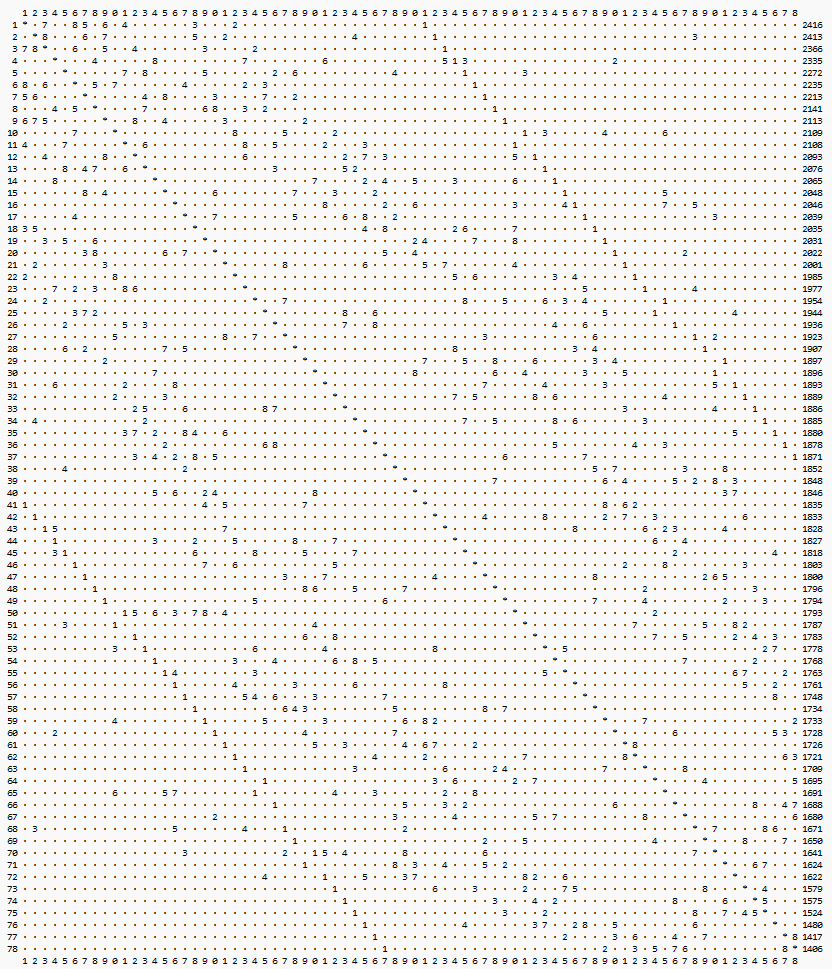
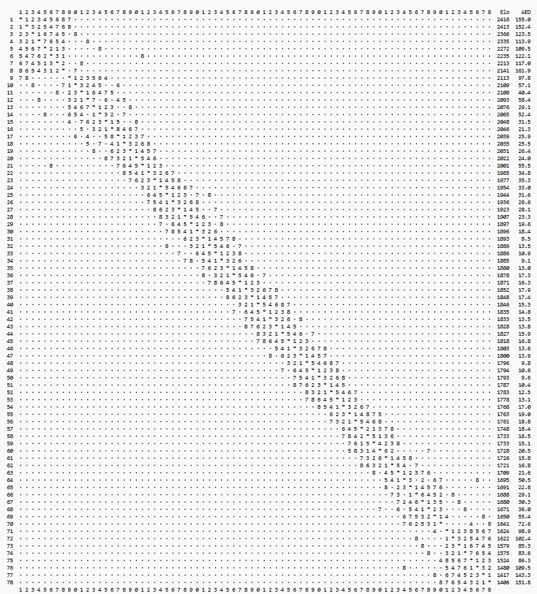

[Turneringsprogrammet](https://christernilsson.github.io/FairPair)

*FairPair har beskrivits som **Flytande Berger**.  
Varje deltagare ligger i mitten av sin egen Bergergrupp*

FairPair är ett alternativ till Schweizer- och Berger-turneringar.  
Bygger på två principer:

1. Alla möter spelare som ligger närmast i rating. 
2. Sortering:
	* Varje spelare spelar en fiktiv remi mot turneringens medelspelare.
	* Performance Rating räknas nu ut, med den matematiskt korrekta metoden.
	* Att PR inte redan används i alla Schweizer-turneringar beror troligen på att man vill kunna räkna för hand.

Berger är den rättvisaste formen, helst dubbelrondig.   
Berger kan dock inte användas med många deltagare.   
Då används Schweizer eller Bergergrupper.

### Poängberäkning enligt FairPair

Man använder motståndarnas elo, tillsammans med vinstprocenten för att beräkna PR.  
Detta är exakt samma metod som den man använder när en spelare ges en initial rating i FIDE:s ratingsystem.  

### Invändningar mot Schweizer

1. De flesta partier har stor skillnad mellan spelarna (CN)
	* Här missar man tillfällen att hämta viktig information
2. Vinster mot starka och svaga spelare värderas exakt lika (CN)
	* Här försvinner viktig information
3. De svagaste spelarna får det hårdaste motståndet (relativt sett) (CN)
	* Vore bra om nya schackspelare kunde få en mjukare start
4. [Exempel](https://chess-results.com/tnr996761.aspx?lan=6&art=9&fed=SWE&snr=17): Spelare med rating 1601  
	Fyra ronder gav följande elo för motståndarna: 1924, 0, 1822, 0  
	Spelaren fick ej möta dessa närliggande: 1559, 1595 och 1657.  
5. Schweizer behöver många särskiljningsregler iom många spelare slåss om få poäng. T ex Tyresö Open: 78 spelare ska fördelas på 15 nivåer.  
	FairPair fördelar 78 spelare på tusentals nivåer. Då minskar behovet av särskiljning.

Ju mer information man använder, desto bättre blir sorteringen. 

### Invändningar mot Berger

1. Om vi startar en bergergrupp med elva spelare och en hoppar av efter första ronden,
kommer alla deltagare att ha en frirond plus en walkover. FairPair ser till att alla spelare får spela varje rond,  
eftersom de nu är tio spelare, dvs jämnt antal. (CN)

### Invändningar mot FairPair

1. Hur vet man vem som vann? (SW)
2. Många spelare vill möta spelare med olika spelstyrkor (POH)
3. Om oratade bara spelar med andra oratade, får de aldrig någon rating. (CN)
4. Det blir fler remier om jämnare spelare möts. (CN)

### Varför sorterar Schweizer och FairPair olika ibland?

Det beror på att Schweizer använder grövre metoder.

### Vilka är dessa grövre metoder?

1. I Schweizer är en vinst alltid exakt en poäng oavsett om man slagit den bäste eller den sämste
	* FairPair tar hänsyn till motståndarnas elo när PR beräknas

2. Schweizer lottar fram ojämna partier med stor elo-skillnad
	* FairPair lottar fram partier där chansen att vinna ligger så nära 50% som möjligt
		*   0 => 50% chans att vinna för den bättre spelaren
		* 100 => 64%
		* 200 => 76%
		* 300 => 85%
		* 400 => 91%
		* 500 => 95%
		* 600 => 97%

### Schweizer (78 spelare)

Starkaste spelaren längst upp till vänster. Cellerna indikerar rondnummer.  
I denna turnering spelades bara 15% av partierna mot de närmaste åtta spelarna, elo-mässigt.

### FairPair (78 spelare)

Hundbenet.

### Måste man möta mycket starkare spelare för att avancera snabbt?

[Arvid Fridman 2019](https://ratings.fide.com/calculations.phtml?id_number=1758632&period=2019-12-01&rating=0) 6.3 elo per klassiskt parti.  
[Ram Srinivasson 2024](https://ratings.fide.com/profile/1779249/chart) 8.3 elo per klassiskt parti
En turnering med sju ronder kan alltså ge en ökning på 58 elo.  
5 av 7 (= 71%) mot lika starka spelare, ger 3 * 20 = 60 elo.  
7 av 7 (=100%) mot lika starka spelare, ger 7 * 20 = 140 elo.  
Man behöver alltså inte möta spelare som är flera hundra elos starkare för att avancera snabbt.

    

### Bergergrupper, ett exempel från SrS 2024 HT

De 56 spelarna delades upp i fem grupper.  
* Klass M: udda antal, ingen bröt
* Klass 1: jämnt antal, en spelare bröt
* Klass 2: udda antal, en spelare bröt
* Klass 3: jämnt antal, ingen bröt
* Klass 4: jämnt antal, en spelare bröt, en var intermittent

N = ospelade partier  
R = ronder  
% = andel ospelade partier  

|Namn|Spelare|R|partier|N|%|
|-|-:|-:|-:|-:|-:|
|Klass M|11|11| 66|11|16.7%|
|Klass 1|12|11| 66| 6| 9.1%|
|Klass 2|11|11| 66|21|31.8%|
|Klass 3|12|11| 66| 0| 0.0%|
|Klass 4|10| 9| 45|11|24.4%|
|Totalt |56||309|49|15.9%|

Om alla spelarna ingått i en enda FairPair-grupp,  
skulle förväntat antal ospelade partier bli 5.5 vid elva ronder.  
Detta pga att spelarna flyter mellan klasserna.  
56/2*11=308 partier => ett bortfall på 5.5/308 = 1.8%  

Som en bonus, skulle förväntat antal partier/spelare för Klass 4 öka från 6.8 till 10.5

 **Om man använt FairPair istället, hade man sänkt bortfallet från 15.9% till 1.8%.**

