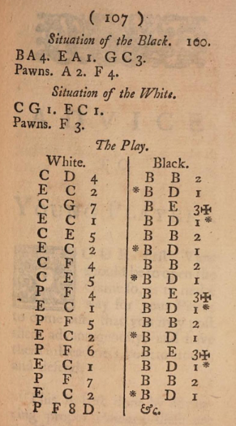

*En liten berättelse om hur övergången från deskriptiv notation till algebraisk gick till.  
Samt ett litet feltänk av Stamma som kanske ledde till att hans förslag inte accepterades till 100%.*

[Phillip Stamma](https://en.wikipedia.org/wiki/Philipp_Stamma) (Aleppo 1705-1755) konstruerade föregångaren till den algebraiska notation vi använder idag.

Han gav 1737 ut boken [The Noble Game of Chess](https://www.google.se/books/edition/The_Noble_Game_of_Chess/D_4UAAAAYAAJ?gbpv=0) på franska, där denna nya notation publicerades för första gången.

*Den engelska upplagan är tämligen lättläst. Om **f** inte passar i sammanhanget, använd **s** istället. T ex **chefs** blir då **chess**.
Om man hoppar över partierna, läser man hela boken på en timme.*

Så här kunde ett parti se ut (Svart har två springare, vit har en löpare):

Som synes används 

	* p/P för alla bönder
	* a/A för torn på a
	* b/B för springare på b 
	* c/C för löpare på c
	* d/D för dam på d
	* e/E för kung på e
	* f/F för löpare på f
	* g/G för springare på g
	* h/H för torn på h

Någon symbol för slag användes ej.

Både versaler och gemener förekommer. Både för att indikera pjäs och kolumn.

K kan ses ibland som alternativ till e/E

I Algebraisk notation ser man ibland Nbd2, vilket anger vilken springare som flyttas.  
I Stammas notation anges detta istället Bd2 eller Gd2 beroende på var springaren stod ursprungligen.  
Kan därför vara lämpligt att skriva denna bokstav på springare och torns undersida.  

*Framgår inte hur Stamma hanterade bönder som förvandlades till springare eller torn.  
Man kan ha åtta springare eller åtta damer som kan gå till samma ruta.  
Praktiskt kan man kanske lösa detta genom att införa IJKL, RSTU, WXYZ för promoverade bönder.  
T ex blir I tredje tornet, S fjärde springaren, Z fjärde damen*

Asteriskerna är en hjälp för att veta vilken pjäs som ska flyttas i Nbd2-fallet. Asterisken till vänster innebär att springaren till vänster ska flyttas och vice versa.

*Hur anger man vilket torn som ska flyttas i fallet Rc8 och Rc1?*

En fördel med Stammas notation är att den är internationell.

* Jämför t ex engelska KQBNR med svenska KDLST

Den förhärskande notationen vid denna tid var den deskriptiva.  
Notera att två bokstäver, behövs istf en.  
Dessutom numrerar svart raderna tvärtom gentemot vit.  
I USA använde man ofta Kt istället för N fram till 1980.  

Byrne - Fischer 1956:

Först 1980 bestämde FIDE att algebraisk notation skulle bli standard.  

*Frankrike gick sist av alla över 1993, 256 år efter att Stammas bok gavs ut i just det landet.*

[Thank You, Phil Stamma](https://tartajubow.blogspot.com/2019/03/thank-you-phil-stamma.html?lr=1726509521249)
